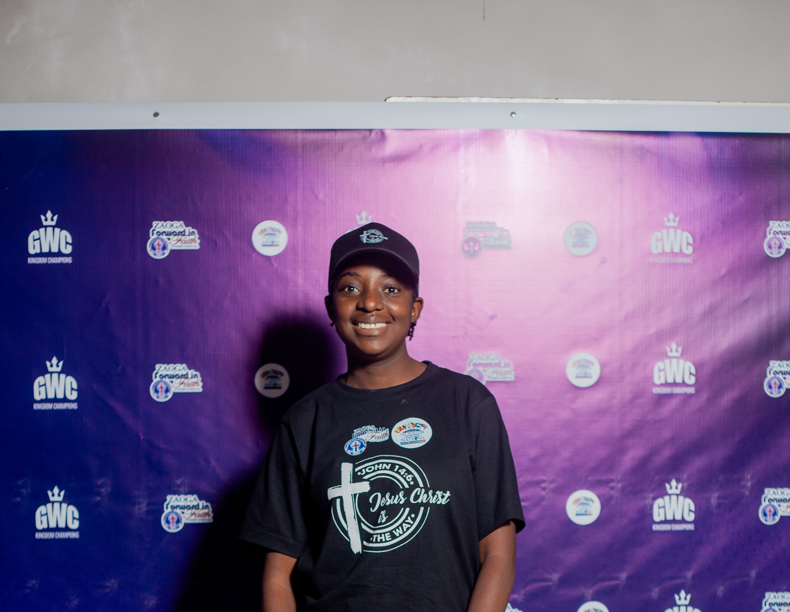

# Mitchel Maregere — Portfolio Site

Multi-page developer portfolio, ready for GitHub Pages.

## Structure
```
index.html        Home
about.html         About
skills.html        Skills
projects.html       Featured Projects (hub page)
contact.html         Contact
resume.html           Resume (embeds assets/resume.pdf)
css/style.css          Shared styles
js/main.js               Mobile nav toggle
assets/resume.pdf          Your CV
projects/
  painting-company/index.html   ← replace with your real site
  restaurant/index.html         ← replace with your real site
  salon/index.html              ← replace with your real site
  auto-services/index.html      ← replace with your real site
```

## 1. Replace the project placeholders
Each folder under `projects/` currently has a placeholder `index.html`.
Delete its contents and drop in your actual website files (HTML/CSS/JS/images),
keeping the main file named `index.html` so the links from the Projects page
keep working. If a site has its own subfolders (e.g. `css/`, `img/`), that's fine —
just keep everything inside that project's folder.

## 2. Update placeholder links
In `index.html`, `projects.html`, and the footer of every page, swap:
- `https://github.com/rutendomitchell` → your actual GitHub profile URL
- The `Source` links on `projects.html` → your actual repo URLs for each demo site
  (or delete the `Source` link if you're not keeping them in separate repos)

## 3. Deploy to GitHub Pages
1. Create a repository named exactly `YOUR_USERNAME.github.io` on GitHub.
2. From this folder, run:
   ```bash
   git init
   git add .
   git commit -m "Initial portfolio site"
   git branch -M main
   git remote add origin https://github.com/YOUR_USERNAME/YOUR_USERNAME.github.io.git
   git push -u origin main
   ```
3. On GitHub: **Settings → Pages → Source** → select branch `main`, folder `/root` → Save.
4. Your site goes live at `https://YOUR_USERNAME.github.io` within a minute or two.

## 4. Contact form (optional)
`contact.html` currently points the form's `action` to a placeholder Formspree URL
(`https://formspree.io/f/your-form-id`). Sign up at formspree.io (free tier works),
create a form, and paste your real endpoint in to receive submissions by email —
GitHub Pages can't run server-side code, so a service like Formspree (or Netlify
Forms if you switch hosts) is the simplest fix.

## 5. Swap the photo placeholder
`about.html` has an empty `.about-photo` block. Add a real photo to `assets/`
(e.g. `assets/profile.jpg`) and replace the placeholder div with:
```html

```
